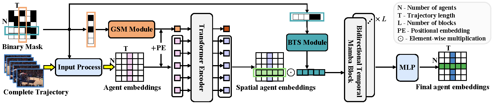

# Deciphering Movement: Unified Trajectory Generation Model for Multi-Agent


<div align="left">
    <a></a>
    <a></a>
</div>

[arXiv]() | Primary contact: [Yi Xu](xu.yi@northeastern.edu)

<div align="center">
  
</div>

Detailed architecture of the encoding process, which consists of two main components: a Transformer encoder equipped with the GSM model, and a Mamba-based encoder featuring the BTS module. These components are designed to capture comprehensive spatial-temporal features and enable the model to learn missing patterns, thus generalizing to various missing situations.

## BibTeX
```
```

## Datasets
The raw Basketball dataset is from [Stats Perform](https://www.statsperform.com/artificial-intelligence-in-sport/), you can download from thie [repo](https://github.com/ezhan94/calibratable-style-consistency?tab=readme-ov-file).

The raw Football dataset is from [Next Gen Stats](https://nextgenstats.nfl.com/), as in [github](https://github.com/nfl-football-ops/Big-Data-Bowl), please reach out to them for complete tracking files.

The raw Soccer dataset is from [SoccerTrack](https://github.com/AtomScott/SportsLabKit) of the top-view scenarios.

Put downloaded datasets anywhere such as:
```
anywhere
├── base_datasets
│   ├── basketball
│   │   │   │── train.npz
│   │   │   │── test.npz
│   │   │   │── ...
│   ├── football
│   │   │   │── file01
│   │   │   │── file02
│   │   │   │── ...
│   ├── soccer
│   │   │   │── top_view
│   │   │   │── ...

```

## Datasets Pre-process
### Basketball
```
cd UniTraj/preprocess/basketball
python clean_dataset.py
```
### Football
```
cd UniTraj/preprocess/football
python read_csv.py
python clean_dataset.py
```

### Soccer
```
cd UniTraj/preprocess/soccer
python read_csv.py
```
After this, you will get train_clean.p/test_clean.p files for model training.

## Environment
```
conda env create -f environment.yml
```
**OR**

First install PyTorch
```
conda create -n unitraj python==3.11.8 -y
conda activate unitraj
conda install pytorch==2.2.1 torchvision==0.17.1 torchaudio==2.2.1 pytorch-cuda=11.8 -c pytorch -c nvidia
```

Then install [Mamba](https://github.com/state-spaces/mamba) 
```
pip install causal-conv1d>=1.2.0
pip install mamba-ssm
```

Some other dependecies (maybe)
```
pip install tqdm
pip install tensorboardX
...
```


## Checkpoints
You can download our trained checkpoints and logs from:
[Google Drive](https://drive.google.com/drive/folders/1qA5f8GgiIKLFSjuxgIUoNO1fQxe7J5el?usp=drive_link).

The structure looks like:
```
UniTraj
├── checkpoint/
│   ├── basketball
│   │   ├── unitraj
│   │   │   │── best_ade_epoch.pth
│   │   │   │── last_epoch.pth
│   │   │   │── log.txt
│   ├── football
│   │   ├── unitraj
│   │   │   │── best_ade_epoch.pth
│   │   │   │── last_epoch.pth
│   │   │   │── log.txt
│   ├── soccer
│   │   ├── unitraj
│   │   │   │── best_ade_epoch.pth
│   │   │   │── last_epoch.pth
│   │   │   │── log.txt
├── datasets/
├── models/
├── preprocess/
├── environment.yml
├── functions.py
├── option.py
├── main.py
├── option.py
├── runner.py
├── README.md
```

## Train
### Train from scratch
```
python main.py \
    --learn_prior \
    --dataset_path anywhere/base_datasets \
    --dataset_name soccer
```
You can replace the dataset_name with basketball or football.
The epoch with the best minADE and the last epoch will be saved under './checkpoint/dataset_name/unitraj/...'

You can also save with another name by using '--extra_note'

### Resume from last epoch
```
python main.py \
    --learn_prior \
    --dataset_path anywhere/base_datasets \
    --dataset_name soccer \
    --is_resume
```

## Evaluate
To get the metrics other than minADE, add '--evaluate', it will load the epoch with the best minADE to evaluate, save the generated trajectories, and write down metric results in the results.txt file.

**Remember to keep configures the same as training**
```
python main.py \
    --learn_prior \
    --dataset_path anywhere/base_datasets \
    --dataset_name soccer \
    --evaluate
```
